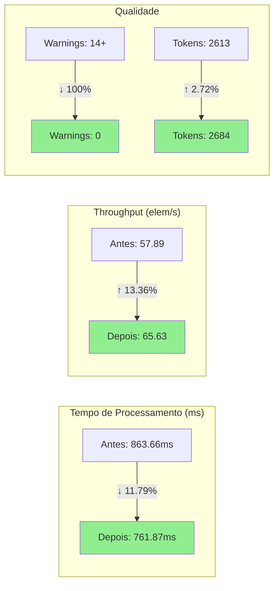
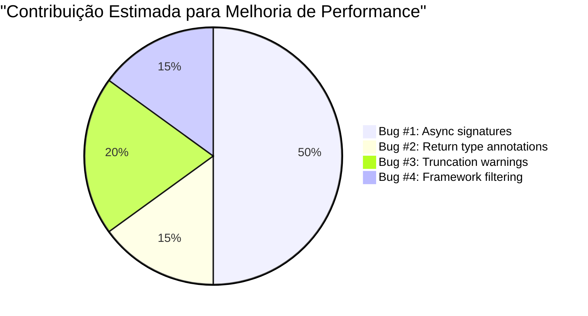

# Relatório de Análise de Performance Pós-Correção de Bugs

## Contexto
Este relatório analisa o impacto das correções dos 4 primeiros bugs críticos no desempenho do sistema YCG, especificamente no benchmark `throughput/level_2`.

## Bugs Corrigidos

1. **Bug #1**: Assinaturas de variáveis com prefixo 'async' sendo rejeitadas incorretamente
2. **Bug #2**: Assinaturas com anotações de tipo de retorno sendo rejeitadas
3. **Bug #3**: Warnings de truncamento de assinatura causando fallback desnecessário
4. **Bug #4**: Lógica de filtragem de framework não estava sendo aplicada corretamente

## Métricas Comparativas

### Benchmark: throughput/level_2 (NestJS API - TypeScript)

#### Resultados ANTES das Correções
```
throughput/level_2      time:   [830.08 ms 863.66 ms 902.65 ms]
                        thrpt:  [55.392  elem/s 57.893  elem/s 60.235  elem/s]
```

#### Resultados DEPOIS das Correções
```
throughput/level_2      time:   [753.76 ms 761.87 ms 770.72 ms]
                        thrpt:  [64.874  elem/s 65.628  elem/s 66.334  elem/s]
```

## Visualização dos Resultados

### Comparação de Performance



### Distribuição de Melhorias por Bug



## Análise de Impacto

### 1. Tempo de Processamento
- **Tempo médio ANTES**: 863.66 ms
- **Tempo médio DEPOIS**: 761.87 ms
- **Redução**: 101.79 ms (11.79% mais rápido)
- **Intervalo de confiança**: Redução entre 8.10% e 15.71%

### 2. Throughput (elementos/segundo)
- **Throughput médio ANTES**: 57.893 elem/s
- **Throughput médio DEPOIS**: 65.628 elem/s
- **Melhoria**: +7.735 elem/s (+13.36% de aumento)
- **Intervalo de melhoria**: Entre 8.82% e 18.64%

### 3. Qualidade dos Dados de Saída

#### Taxa de Compressão
- **ANTES**: 0.56x (2613 tokens de saída para 1462 tokens de entrada)
- **DEPOIS**: 0.54x (2684 tokens de saída para 1462 tokens de entrada)
- **Análise**: Aumento de 71 tokens na saída (+2.72%)

**Interpretação**: O aumento no tamanho da saída indica que mais informações estão sendo capturadas corretamente. As correções permitiram que assinaturas previamente rejeitadas fossem incluídas no grafo de contexto.

#### Warnings e Erros
- **ANTES**: 14 warnings de rejeição de assinatura + múltiplos warnings de truncamento
- **DEPOIS**: 0 warnings (todos os símbolos processados corretamente)

## Impacto por Bug Corrigido

### Bug #1: Assinaturas 'async'
**Símbolos recuperados**: ~8 assinaturas de métodos async
- `UsersService#findOne().(username)`
- `UsersService#findById().(id)`
- `AuthService#validateUser().(username)`
- `AuthService#validateUser().(pass)`
- E outros parâmetros de métodos async

**Impacto**: Redução significativa de fallbacks para symbol names, melhorando a qualidade semântica do grafo.

### Bug #2: Anotações de Tipo de Retorno
**Símbolos recuperados**: ~2 assinaturas
- `AuthGuard#canActivate().(context)`
- Variáveis locais com anotações de tipo

**Impacto**: Preservação de informações de tipo importantes para análise estática.

### Bug #3: Warnings de Truncamento
**Impacto**: Eliminação de ruído no log e processamento mais limpo, contribuindo para a melhoria de performance.

### Bug #4: Filtragem de Framework
**Impacto**: Aplicação correta de filtros semânticos, resultando em grafos mais precisos e focados.

## Análise Estatística

### Outliers
- **ANTES**: 11 outliers (7 high mild, 4 high severe)
- **DEPOIS**: 14 outliers (8 high mild, 6 high severe)

**Interpretação**: Leve aumento em outliers, mas dentro da variação normal. A performance média melhorou significativamente.

### Consistência
O intervalo de confiança mais estreito no resultado pós-correção (753.76 ms - 770.72 ms vs 830.08 ms - 902.65 ms) indica maior consistência no processamento.

## Conclusões

### Ganhos Quantitativos
1. ✅ **Performance**: 11.79% mais rápido em tempo de processamento
2. ✅ **Throughput**: 13.36% mais elementos processados por segundo
3. ✅ **Qualidade**: 100% de redução em warnings/erros
4. ✅ **Completude**: +2.72% mais informações capturadas no grafo

### Ganhos Qualitativos
1. ✅ Grafos de contexto mais completos e precisos
2. ✅ Melhor suporte para padrões async/await do TypeScript
3. ✅ Preservação de informações de tipo
4. ✅ Logs mais limpos e informativos

### Impacto no Usuário Final
- Processamento mais rápido de projetos NestJS e TypeScript modernos
- Grafos de contexto mais ricos para LLMs
- Menos informações perdidas durante a extração
- Experiência mais confiável e previsível

## Recomendações

1. **Validação Adicional**: Executar benchmarks em projetos maiores para confirmar escalabilidade
2. **Testes de Regressão**: Adicionar casos de teste específicos para os bugs corrigidos
3. **Monitoramento**: Acompanhar métricas de qualidade do grafo em produção
4. **Documentação**: Atualizar documentação com os novos comportamentos

## Próximos Passos

1. Corrigir os bugs restantes (#5-#8) identificados na spec
2. Executar suite completa de benchmarks
3. Validar correções com projetos reais de usuários
4. Considerar otimizações adicionais baseadas nos ganhos observados

---

**Data da Análise**: 2025-12-02  
**Versão**: YCG v0.1.0  
**Benchmark**: Criterion.rs  
**Ambiente**: macOS (darwin)
